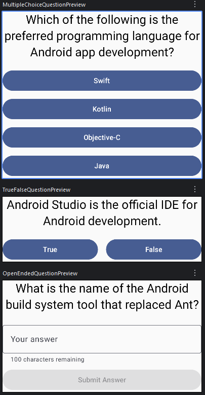
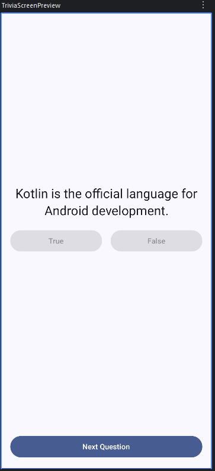

# Android Technical Interview Take Home Challenge

## Table of Contents
- [Welcome](#welcome)
- [Quiz App Challenge](#quiz-app-challenge)
- [Mock-Up](#mock-up)
- [Assessment Tips](#assessment-tips)
  - [Minimum Acceptance Criteria](#minimum-acceptance-criteria)
  - [Extra Credit](#extra-credit)
- [Assessment Submission](#assessment-submission)

## Welcome
Thank you for taking time to interview with Cricut. Below are instructions for a take home
challenge. Feel free to use resources you would employ in a real day-to-day Android job,
research, and have fun.

## Quiz App Challenge
Using Android Studio, implement code in your clone of this repository that meets the following
specifications:

- Project must be shareable via GitHub.
- Project should use Jetpack Compose, Material3, and a consistent MVVM architectural pattern.
- The app does NOT need to implement any API client or be in a ‘ready to ship to the
  PlayStore’ state. We are more interested in how you create a mini-Compose app and the
  architectural decisions you make to complete the task.
- The app should be a 'Quiz App' that displays two different question types of your choice:
  - A true/false question.
  - A multiple choice question with four options but only accepts a single answer.
  - A multiple choice question with four options allowing for multiple options to be selected.
  - A question that allows for the user to type in a textual response (open-ended question).
- The app should consist of a single screen that transitions between two questions or two screens,
  one for each question.
- The questions themselves should be about Android, for example "True or False: An
  Activity is destroyed during recomposition?"
- Display the question and potential answers, allowing the user to select an answer and
  move on to the second question.
- Navigate back from question two to question one and display the previously chosen answer.
- You do NOT need to include any answer validation.
- Display one question at a time.
- We expect the app to comfortably handle configuration changes (e.g., rotation) and
  lifecycle changes (e.g., backgrounding the app).
- Use a 'Next' button or another suitable navigation pattern to move between questions.

## Mock-Up
Below are images of how the app could look. Note that your implementation doesn't have to mimic
this layout precisely. The images are intended to help you visualize the type of end-product we
envision with this assessment.

- 

- 

## Assessment Tips
### Minimum Acceptance Criteria
- Implement a Compose screen(s) (called AssessmentScreen in the project) that allows a user to 
  transition back and forth between two questions and retain state between navigating from one
  question to the next.
- Implement a view model for state management.
- Ensure the app comfortably handles configuration changes (e.g., rotation) and
  lifecycle changes (e.g., backgrounding the app).
- Implement data models to support state and quiz question structures.

### Extra Credit
While you only need to implement the minimum acceptance criteria, please feel free to go above and
beyond with additional features and demonstration of architectural knowledge. Our technical leads
are not just looking for someone who can flex their engineering skills, but also someone who has a
deep understanding of the code they write and can engage in a technical conversation about the code
submitted in this assessment. With that in mind, here are a few things other candidates have done
to better demonstrate their knowledge, but is by no means mandatory:

- implementing a fake repository to fetch data/illustrate asynchronous code execution.
- implementing a 'game over/restart' screen.
- answer validation.
- implementing navigation via Jetpack Navigation or Compose NavHost navigation for submissions with
  more than one screen.
- displaying a progress indicator.
- input validation on open-ended questions.
- conditionally enabled navigation/submission buttons depending on if a question is answered or
  ready to be submitted.
- Unit test coverage.

## Assessment Submission
Please send a link to your Cricut point of contact containing your cloneable GitHub repo. After we
receive the link, our technical leaders will review your submission and we will contact you with
next steps.

If you have any questions, please reach out to us! We are looking forward to your submission
and the conversations that will sprout from it.
